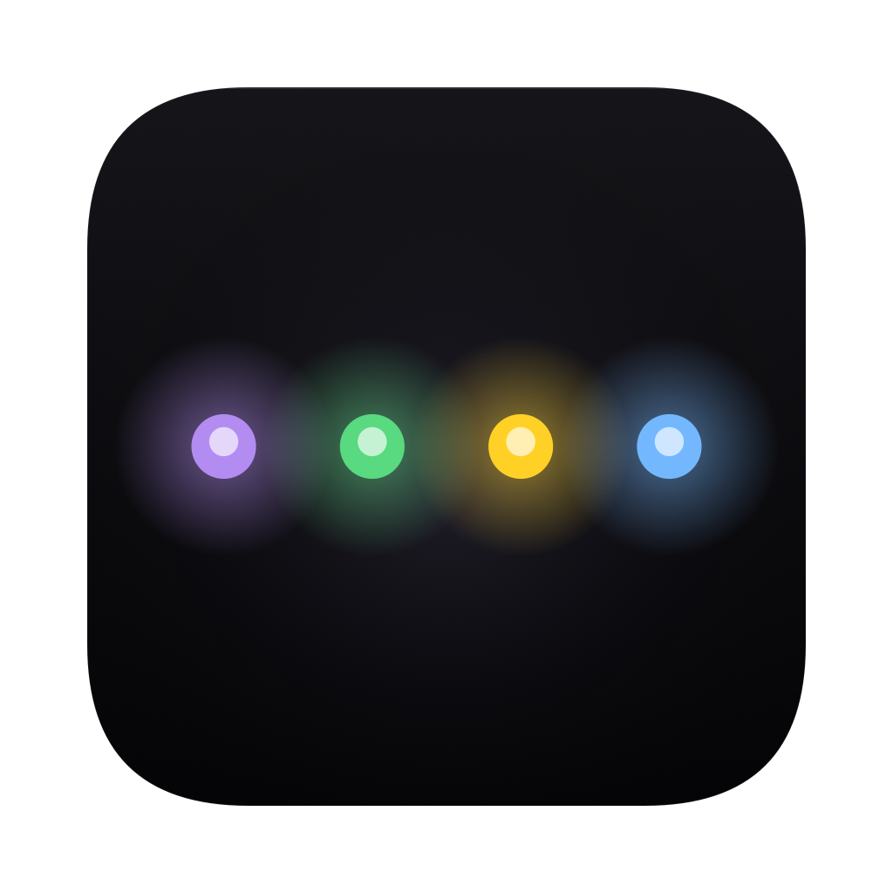
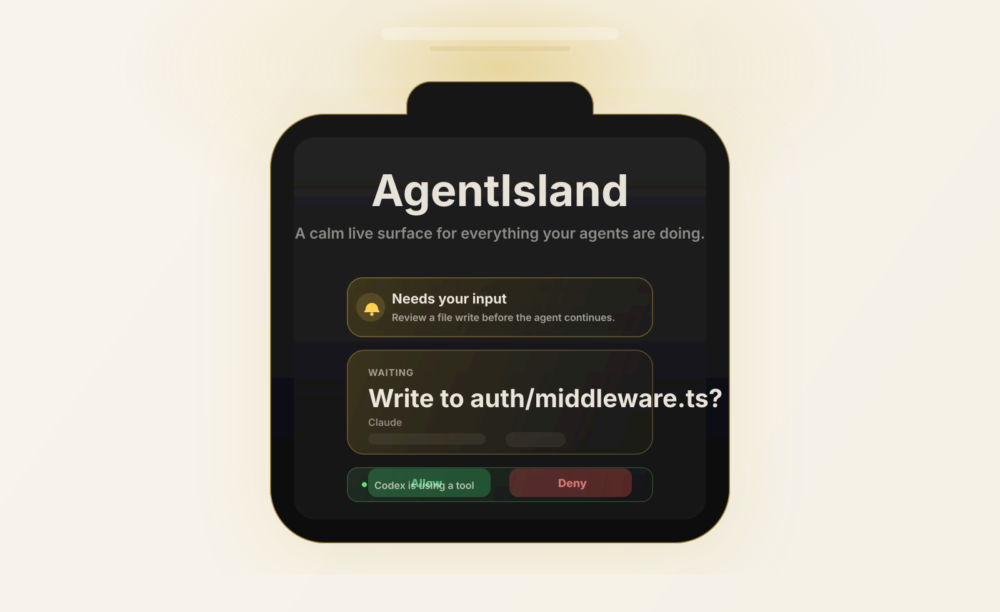
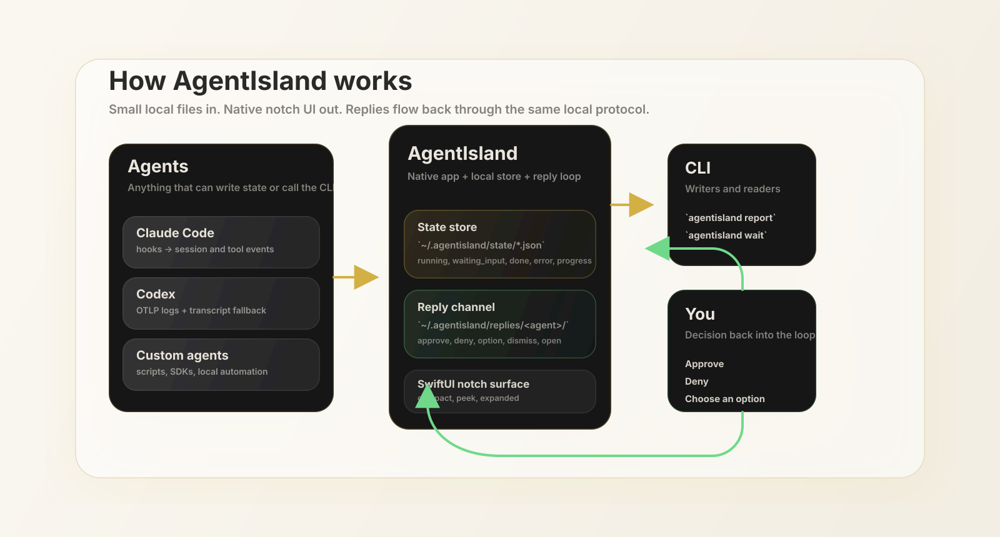

# AgentIsland

<div align="center">
  

  <p>
    <strong>Native macOS notch UI for coding agents.</strong>
  </p>

  <p>
    Keep Claude Code, Codex, and your own agents in one calm live surface at the top of your screen.
  </p>

  <p>
    <a href="https://github.com/HarryB25/agentisland/releases/latest"><strong>Download for macOS</strong></a>
    ·
    <a href="#install">Install</a>
    ·
    <a href="#connect-an-agent">Connect an agent</a>
    ·
    <a href="#30-second-protocol">Protocol</a>
    ·
    <a href="#build-from-source">Build from source</a>
  </p>

  <p>
    
    
    
    
  </p>
</div>

<p align="center">
  
</p>

AgentIsland is a native macOS app for people who run coding agents all day.

Claude Code in one terminal. Codex in another. A local script somewhere else. Something is thinking, something is blocked, something finished ten minutes ago, and the cost of checking all of it is your focus.

AgentIsland turns that into one glanceable system surface:

- quiet when work is progressing normally
- visible when an agent needs approval or hits an error
- brief completion peeks when a task finishes
- open enough that any agent can join with a tiny local protocol

It is meant to feel like a system affordance, not another dashboard.

## Why it feels good

- Local-first: state lives in `~/.agentisland`, not in a cloud backend.
- Native: built in SwiftUI for macOS, designed around the notch and menu bar.
- Calm by default: hover expands directly, high-priority states can proactively peek.
- Open protocol: if a tool can write one state file or call one CLI, it can appear in the island.

## Install

Choose the path that matches how you want to use it.

| Path | Best for | Command |
| --- | --- | --- |
| DMG | Standard macOS install | [Download the latest release](https://github.com/HarryB25/agentisland/releases/latest) |
| Homebrew Cask | Developers who want upgrades via Brew | `brew tap HarryB25/agentisland https://github.com/HarryB25/agentisland && brew install --cask agentisland` |
| CLI only | Headless adapters, automation, custom agents | `curl -fsSL https://github.com/HarryB25/agentisland/releases/latest/download/install.sh \| bash` |
| CLI + app | Terminal-first setup with the desktop app too | `curl -fsSL https://github.com/HarryB25/agentisland/releases/latest/download/install.sh \| bash -s -- --app` |

Release assets include Apple Silicon and Intel builds for:

- `agentisland-macos-arm64.dmg`
- `agentisland-macos-arm64.zip`
- `agentisland-macos-x86_64.dmg`
- `agentisland-macos-x86_64.zip`
- `agentisland-cli-macos-arm64.tar.gz`
- `agentisland-cli-macos-x86_64.tar.gz`
- `install.sh`

The app and the CLI are intentionally separate:

- use the app if you only want the notch surface
- use the CLI if you want adapters, scripting, or custom reporting
- use `install.sh --app` if you want both in one pass

## First minute

1. Launch `AgentIsland.app`.
2. Leave it running in the background.
3. Install one adapter for the agent you already use.
4. Watch the notch wake up when real work starts.

## Connect an agent

### Claude Code

If you installed from a release:

```bash
~/.local/share/agentisland/scripts/install-claude-hooks.sh
```

If you are running from source:

```bash
./scripts/install-claude-hooks.sh
```

### Codex

If you installed from a release:

```bash
~/.local/share/agentisland/scripts/install-codex.sh
```

If you are running from source:

```bash
./scripts/install-codex.sh
```

### Custom agents

Anything that can call a CLI can join:

```bash
agentisland report \
  --id build-bot \
  --kind custom \
  --name "Build Bot" \
  --status running \
  --phase running \
  --task "Running integration tests..." \
  --progress 0.4
```

## Live states

| State | Meaning | Behavior |
| --- | --- | --- |
| `thinking` | model is reasoning | visible but quiet |
| `running` | tool call or execution in progress | visible but quiet |
| `waiting_input` | approval, question, or option selection | peeks automatically |
| `done` | task finished | peeks briefly, then gets out of the way |
| `error` | action failed or needs intervention | peeks automatically and escalates visually |

The compact notch stays almost silent. Hover expands it directly. High-priority states can proactively peek without forcing a full expansion.

## Supported agents

Current integrations:

- Claude Code via hooks
- Codex via local OTLP receiver plus transcript fallback
- Custom agents via `agentisland report`

The protocol is intentionally small. If a tool can write one JSON state file, it can show up in the island.

## 30-second protocol

The UI reads agent state from:

```text
~/.agentisland/state/<agent_id>.json
```

Your agent can update state through the CLI:

```bash
agentisland report \
  --id build-bot \
  --kind custom \
  --name "Build Bot" \
  --status running \
  --phase running \
  --task "Running integration tests..." \
  --progress 0.4
```

For approvals or choices:

```bash
agentisland report \
  --id build-bot \
  --kind custom \
  --name "Build Bot" \
  --status waiting_input \
  --attention \
  --request deploy-001 \
  --task "Deploy to staging?" \
  --action allow:Allow:approve \
  --action deny:Deny:deny
```

Then wait for the reply:

```bash
agentisland wait --id build-bot --request deploy-001 --timeout 600
```

Replies are written to:

```text
~/.agentisland/replies/<agent_id>/
```

## Architecture

<p align="center">
  
</p>

```text
┌────────────────────────────────────────────────────┐
│ AgentIsland.app                                    │
│ SwiftUI notch UI + local OTLP receiver + watchers  │
└──────────────────────────▲─────────────────────────┘
                           │
               reads ~/.agentisland/state/*.json
                           │
   ┌───────────────────────┼───────────────────────┐
   │                       │                       │
Claude Code            Codex                 Custom scripts
hooks                  OTLP / transcript     CLI or SDK
```

There is no cloud account, no telemetry backend, and no daemon dependency. The state directory is the system of record.

## Build from source

Requirements:

- macOS 13+
- Xcode Command Line Tools or Xcode with Swift 5.9+

```bash
git clone https://github.com/HarryB25/agentisland.git
cd agentisland
swift build -c release
swift run AgentIslandApp
```

## Packaging and releases

Local packaging:

```bash
./scripts/release/build-release-assets.sh v0.1.0
```

Draft GitHub release:

```bash
./scripts/release/publish-release.sh v0.1.0
```

Published GitHub release:

```bash
./scripts/release/publish-release.sh v0.1.0 --publish
```

Automated GitHub release:

- push a tag like `v0.1.0`, or
- run the `Release` workflow manually in GitHub Actions

The workflow builds the app on macOS, packages all release assets, and uploads them to GitHub Releases.

## Homebrew

This repo includes a tap-ready cask at [`Casks/agentisland.rb`](./Casks/agentisland.rb).

It installs the latest desktop ZIP from GitHub Releases, which keeps the tap lightweight and avoids hand-updating checksums on every release.

## Roadmap

- [x] Native notch UI
- [x] Claude Code adapter
- [x] Codex OTLP + transcript integration
- [x] Two-way approval and option reply protocol
- [x] Release packaging for app and CLI
- [ ] SDKs for Python and TypeScript
- [ ] More adapters beyond Claude Code and Codex
- [ ] Optional click-to-focus deep links across terminals and editors

## License

MIT.
